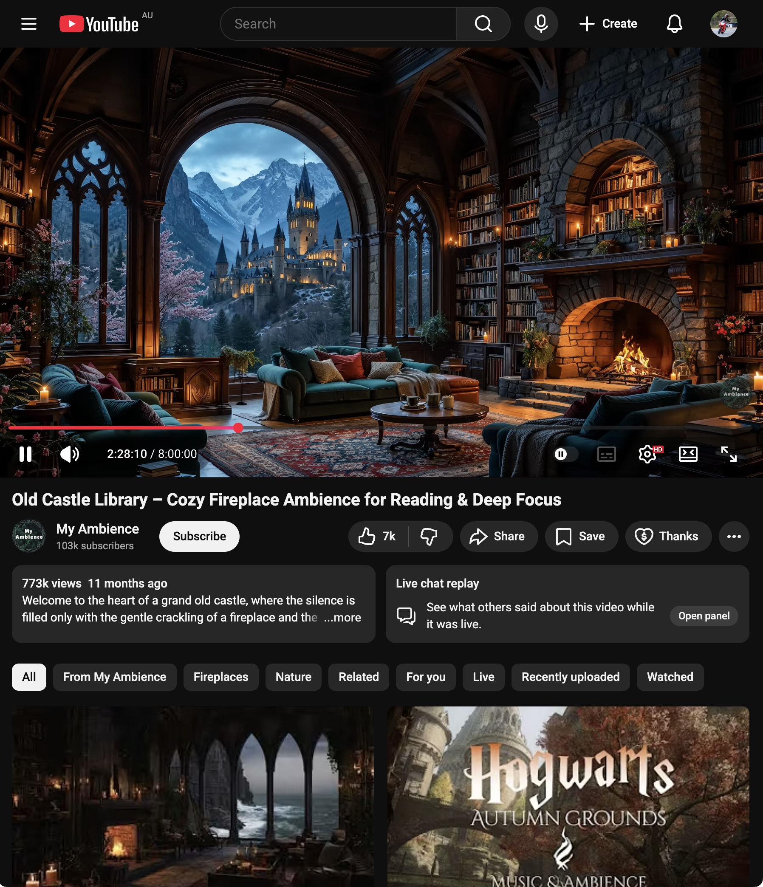

<h1 align="center">Cosy YouTube</h1>

    

I love YouTube, I don't love all the fluff that comes with the UI.

## How It Works

Cosy YouTube transforms your YouTube experience by expanding the video, and removing UI elements that distract from that cosy experience.

| Without Cosy YouTube                           | With Cosy YouTube                        |
| ---------------------------------------------- | ---------------------------------------- |
|  |  |

## Installation

> Note: manual installation is necessary for the meantime until I get the extension on the store!

1. Download `cosy-youtube.zip` from the [latest release](../../releases/latest) and unzip it somewhere permanent
   - It has to be in a permanent location as chrome loads the extension from that folder each time
2. Open `chrome://extensions` and enable **Developer mode** (top-right toggle)
3. Click **Load unpacked** and select the unzipped folder (the one containing `manifest.json`)
4. Head to any YouTube video and click the Cosy YouTube icon in the toolbar to toggle it on!
